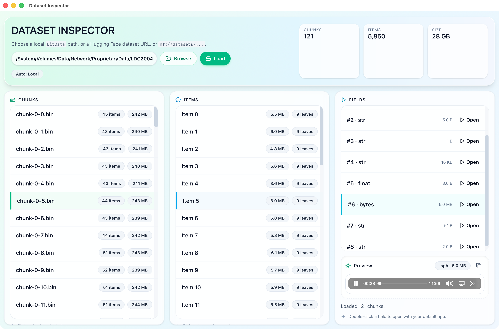
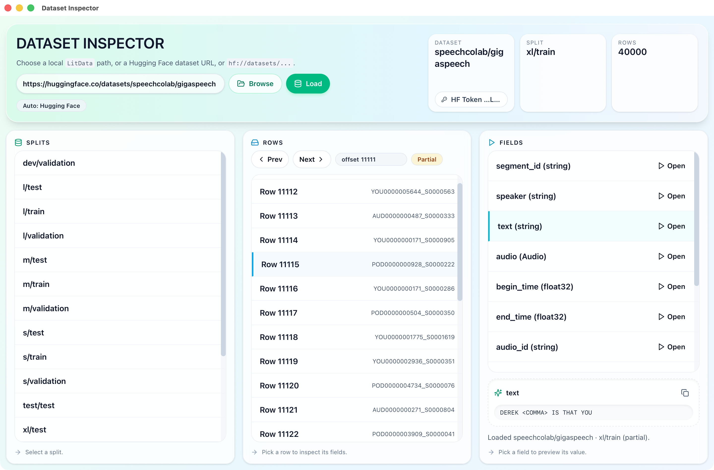

  

<h1 align="center">Dataset Inspector</h1>

  
  
  

## About
Dataset Inspector (previously named LitData Viewer) is a desktop UI for inspecting [Lightning-AI/litData](https://github.com/Lightning-AI/litData) chunked shards and Hugging Face streaming datasets.

## Features
- Inspect local LitData shards (`index.json` + `.bin/.zst` chunks).
- Preview Hugging Face datasets via streaming API (no full local download).
- Preview text/hex/JSON, copy values, and open extracted fields with your default app.

  
  

## Usage
1. Download Dataset Inspector installers from [Releases](https://github.com/binbinsh/dataset-inspector/releases).
2. Browse a local LitData path, or a Hugging Face dataset URL / `hf://datasets/...`, then press **Load**.
3. LitData shards: pick a chunk → item → field, then preview fields
4. Hugging Face datasets: pick a split → row → field to preview values.
5. Report issues/ feature requests: https://github.com/binbinsh/dataset-inspector/issues

## Development
See `docs/development.md`.
