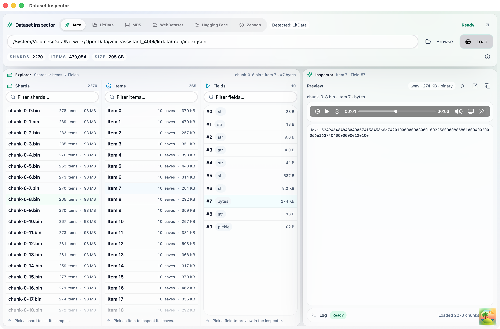
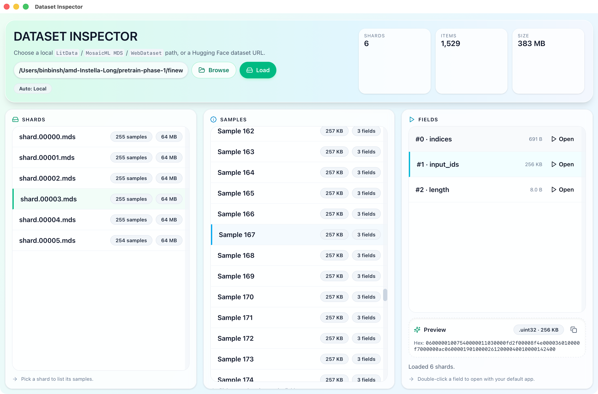
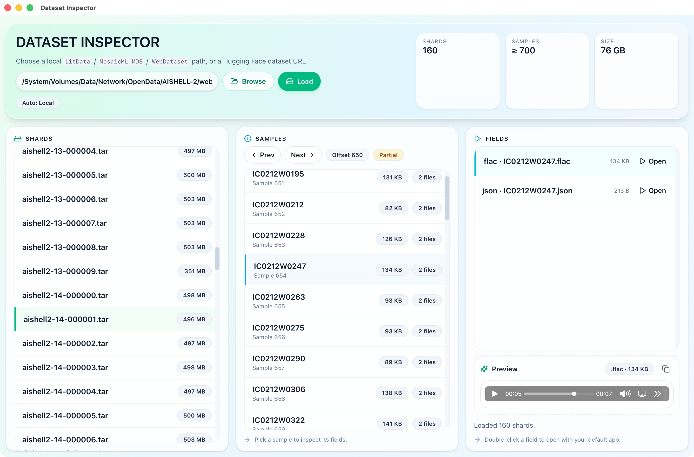
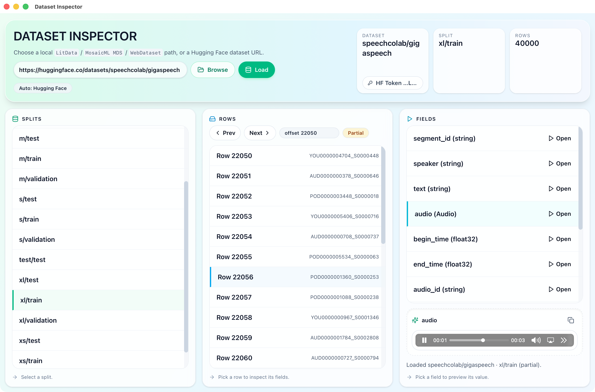
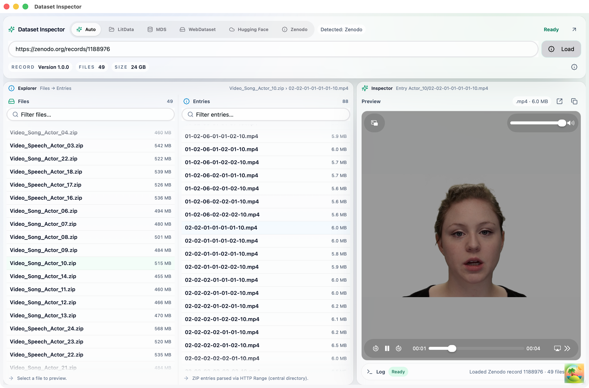

  

<h1 align="center">Dataset Inspector</h1>

  
  
  

## About
Dataset Inspector is a desktop UI for inspecting local [Lightning-AI/litData](https://github.com/Lightning-AI/litData) shards, [MosaicML Streaming](https://github.com/mosaicml/streaming) (MDS) shards, and [WebDataset](https://github.com/webdataset/webdataset) tar shards, with support for previewing [Hugging Face](https://huggingface.co/blog/streaming-datasets) and [Zenodo](https://www.zenodo.org) datasets directly online without downloading.

## Features
- Inspect local LitData shards (`index.json` + `.bin/.zst` chunks).
- Inspect local MosaicML Streaming (MDS) shards (`index.json` + `.mds/.mds.zst`).
- Inspect local WebDataset shards (`.tar`, `.tar.gz`, `.tar.zst`).
- Inspect Hugging Face datasets via streaming API (no full local download).
- Inspect Zenodo datasets via HTTP Range request (no full local download).
- Preview json/audio/image, copy values, and open extracted fields with your default app.

<table align="center">
  <tr>
    <td align="center" width="33%">
      
       
      Local LitData shards
    </td>
    <td align="center" width="33%">
      
       
      Local MosaicML Streaming shards
    </td>
    <td align="center" width="33%">
      
       
      Local WebDataset tar shards
    </td>
  </tr>
</table>
<table align="center">
  <tr>
    <td align="center" width="50%">
      
       
      Hugging Face dataset preview
    </td>
    <td align="center" width="50%">
      
       
      Zenodo record preview
    </td>
  </tr>
</table>

## Usage
1. Download Dataset Inspector installers from [Releases](https://github.com/binbinsh/dataset-inspector/releases).
2. Browse local LitData/MosaicML/WebDataset folders, or HF URLs, or Zenodo URLs, then press **Load**.
3. LitData / MosaicML shards: pick a shard → item → field, then preview fields.
4. WebDataset shards: pick a shard → sample → field, then preview/open files.
5. Hugging Face datasets: pick a split → row → field to preview values.
6. Report issues/ feature requests: https://github.com/binbinsh/dataset-inspector/issues
