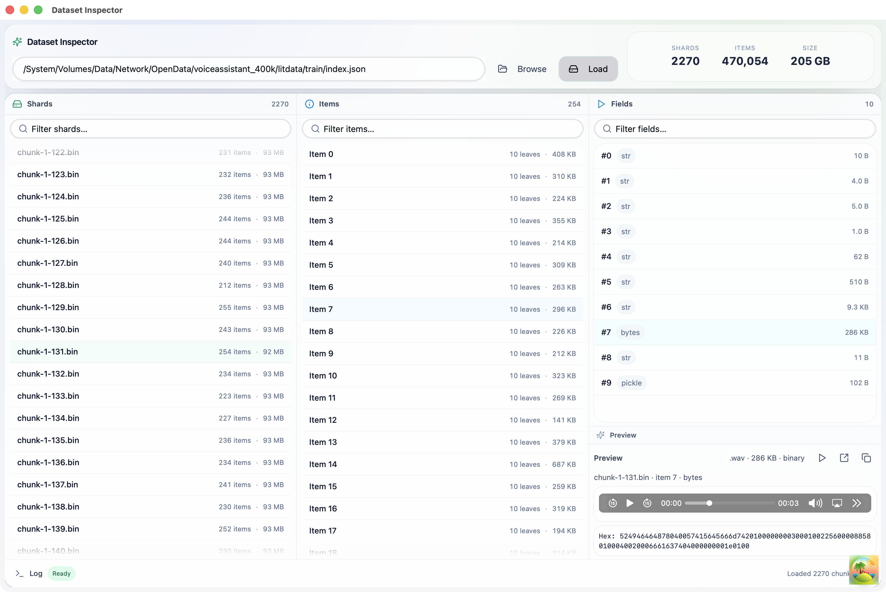
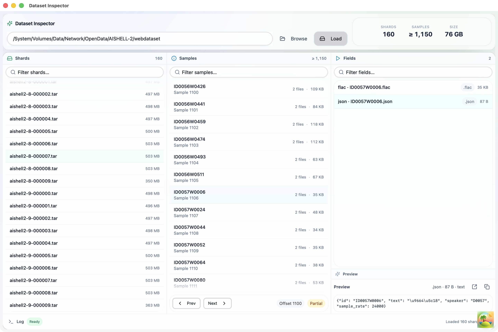
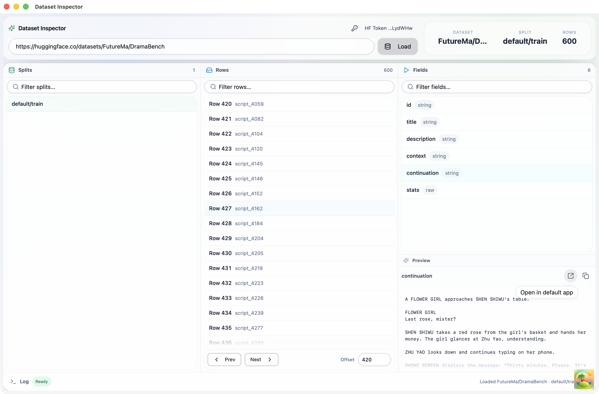
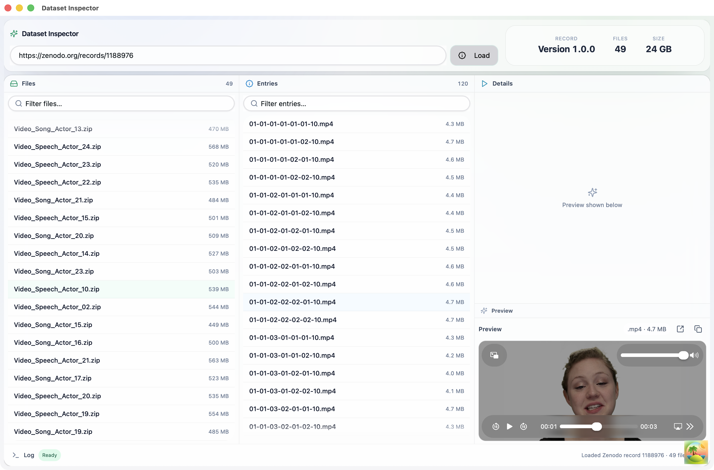

  

<h1 align="center">Dataset Inspector</h1>

## About
Dataset Inspector is a desktop UI for inspecting local [Lightning-AI/litData](https://github.com/Lightning-AI/litData) shards, [MosaicML Streaming](https://github.com/mosaicml/streaming) (MDS v2) shards, and [WebDataset](https://github.com/webdataset/webdataset) tar shards, with support for previewing [Hugging Face](https://huggingface.co/blog/streaming-datasets) and [Zenodo](https://www.zenodo.org) datasets directly over HTTP without full downloads.
Supported platforms: Windows, macOS, and Linux (web planned).

## Features
- Auto-detect local LitData indexes/chunks, MosaicML MDS v2, and WebDataset shards (`.tar`, `.tar.gz`, `.tar.zst`).
- Preview Hugging Face datasets via the dataset viewer API (optional token).
- Preview Zenodo records and browse ZIP/TAR entries with HTTP range requests.
- Rich previews for JSON/text, images, audio, and video.
- Open fields with the default app, or choose and remember a custom opener per extension.
- Built-in update checks and installer download.

<table align="center">
  <tr>
    <td align="center" width="50%">
      
       
      Local LitData shards
    </td>
    <td align="center" width="50%">
      
       
      Local WebDataset tar shards
    </td>
  </tr>
</table>
<table align="center">
  <tr>
    <td align="center" width="50%">
      
       
      Hugging Face dataset preview
    </td>
    <td align="center" width="50%">
      
       
      Zenodo record preview
    </td>
  </tr>
</table>

## Usage
1. Download Dataset Inspector installers from [Releases](https://github.com/binbinsh/dataset-inspector/releases).
2. Paste a local dataset path or Hugging Face/Zenodo URL, then press **Load**.
3. Local shards: pick a shard/chunk -> item/sample -> field, then preview fields.
4. Hugging Face: pick a config/split -> row -> field (add a token if needed).
5. Zenodo: pick a record -> file -> entry (ZIP/TAR), then preview/open files.
6. Report issues/feature requests: https://github.com/binbinsh/dataset-inspector/issues

## Docs
- LitData: `docs/litdata.md`
- MosaicML MDS: `docs/mosaicml.md`
- WebDataset: `docs/webdataset.md`
- Hugging Face: `docs/huggingface.md`
- Zenodo: `docs/zenodo.md`
- Audio preview: `docs/audio.md`
- Development: `docs/development.md`
